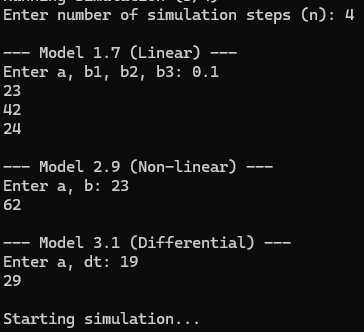
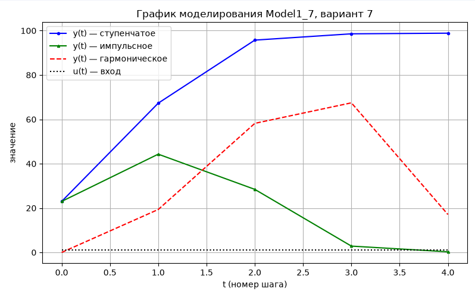
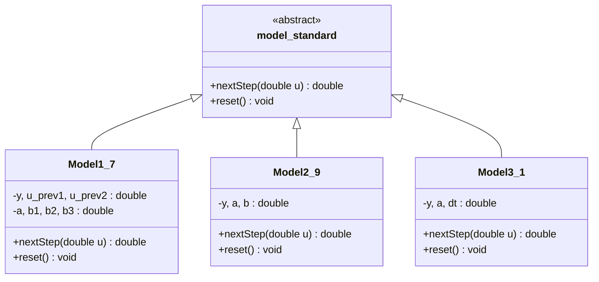

<p align="center"> Министерство образования Республики Беларусь</p>
<p align="center">Учреждение образования</p>
<p align="center">“Брестский Государственный технический университет”</p>
<p align="center">Кафедра ИИТ</p>
<br><br><br><br><br><br><br>
<p align="center">Лабораторная работа №1</p>
<p align="center">По дисциплине “Общая теория интеллектуальных систем”</p>
<p align="center">Тема: “Моделирования температуры объекта”</p>
<br><br><br><br><br>
<p align="right">Выполнил:</p>
<p align="right">Студент 2 курса</p>
<p align="right">Группы ИИ-30</p>
<p align="right">Пырх Д. В.</p>
<p align="right">Проверил:</p>
<p align="right">Дворанинович Д. А.</p>
<br><br><br><br><br>
<p align="center">Брест 2026</p>

## Вариант 7

- Линейная модель: **Model 1.7**
- Нелинейная модель: **Model 2.9**
- Дифференциальное уравнение: **Model 3.1**

## Реализованные модели

### Model 1.7

`y(t+1) = a*y(t) + b1*u(t) + b2*u(t-1) + b3*u(t-2)`

### Model 2.9

`y(t+1) = a*y(t) + b*sqrt(|u(t)|)*sign(u(t))`

### Model 3.1

`dy/dt = -a*y`

## Входные воздействия

1. **Ступенчатое:** `u(t) = 1.0`
2. **Импульсное:** `u(0) = 1.0`, `u(t > 0) = 0.0`
3. **Гармоническое:** `u(t) = sin(t)`

## ООП

Создан абстрактный базовый класс `model_standard` с виртуальными методами `nextStep(double u)` и `reset()`.

От него наследуются:
- `Model1_7`
- `Model2_9`
- `Model3_1`

## Результат

Программа:
- запрашивает количество шагов симуляции `n`;
- запрашивает коэффициенты для каждой модели;
- прогоняет 3 модели;
- выводит результаты в виде таблиц;
- сохраняет результаты в `.csv`;
- строит график через Python/Matplotlib.

## Пример работы программы:

### Сборка

На Windows build.bat:

```bat
@echo off
title Build task_1

echo Configure project (1/4)
cmake -S src -B build
if %errorlevel% neq 0 goto error

echo.
echo Building project (2/4)
cmake --build build --config Release
if %errorlevel% neq 0 goto error

echo.
echo Running simulation (3/4)
if exist build\Release\ii03018_task.1.exe (
build\Release\ii03018_task.1.exe
) else (
build\ii03018_task.1.exe
)

echo.
echo Graph
python plot.py
if %errorlevel% neq 0 (
    echo [!] Python error. Check if python and matplotlib are installed.
)

echo.
pause
exit /b 0

:error
echo.
echo BUILD ERROR
pause
exit /b 1
```
### Демонстрация реализации:

### Демонстрация одного из графиков:

## UML-диаграмма

